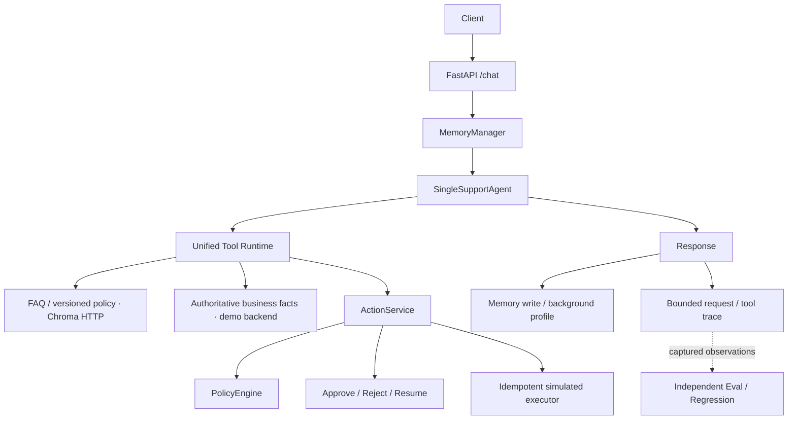

# CartCare

E-commerce Support Agent

CartCare 是面向 FAQ、商品、订单、物流、库存和售后的 **Single Support Agent** 项目。它展示如何把模型的工具选择与确定性业务控制接成可观察、可验证的客服流程。当前使用真实模型、Redis 和外部 Chroma HTTP；商城与动作执行使用明确标注的演示后端。

## What it does

- 回答政策 / FAQ，展示检索来源与版本；不足时保留 low_confidence / no_answer / degraded 状态。
- 通过 Provider 查询订单、物流、商品、库存和退款状态；缺少必要参数时由 Agent 澄清。
- 请求退款或取消订单，由 PolicyEngine 和 ActionService 控制资格、审批、二次校验与幂等。
- 在 `/demo` 查看最终回答、工具参数与结果、引用、Policy、Pending approval、动作状态和请求耗时。

## Architecture



实际入口：`api/main.py:chat` → `MemoryManager.get_context` → `SupportRuntime.run` → `SingleSupportAgent.handle` → `BaseAgent._call_llm` → `agents/tools.py` / `core/tool_contract.py`。最多 3 轮 Tool Calling；随后写回 Memory、调度画像更新、返回回答与引用。RAG 由 Agent 按需选择，不是每次请求的前置固定阶段。Eval 独立触发，不在每次 `/chat` 中运行。

## Key engineering decisions

- **单 Agent + 工具**：当前电商 workload 未证明多 Agent 协作收益。T10 对比支持简化，生产入口不再经过 Intent / specialist dispatch / supporting Agent / Composer。旧 Multi 仅保留为历史实验。
- **知识与事实分离**：政策解释来自 RAG；订单、库存和物流必须重新查 Provider，不能从检索文本或历史回复推断当前状态。
- **统一工具边界**：严格 schema、read / write / dangerous 风险、typed errors、timeout / retry 元数据。仅幂等读工具自动重试可重试错误；危险动作由 ActionService 控制。
- **可观察而不暴露隐藏推理**：Trace 展示已执行的工具、校验输入、结果摘要与错误，记录模型调用次数，不保存隐藏 chain-of-thought。`mcp/` 是自研本地工具层，尚非标准 MCP SDK / transport 接入。

## End-to-end examples

| 场景 | 用户输入 | 应观察的执行证据 |
|---|---|---|
| FAQ / policy | 退款政策是什么？ | search_knowledge_base → retrieval_status → citation / source / 文档标题 / policy_version |
| Order lookup | 查询我的订单 ORD-T09-ORDER | get_order → validated_input → Provider 结果；Memory 不替代最新查询 |
| Refund approval | 为 ORD-T09-REFUND-APPROVAL 提交 600 元部分退款 | request_refund → require_approval → awaiting_approval；点击 Approve / Reject 查看 ActionResult |

这些是演示输入与观察目标，模型输出和实际工具调用不预设成功。Trace 中没有 ActionService 结果时，UI 不从回答推定动作已完成。库存缺少 SKU 时应澄清；ownership violation 使用 customer-2 请求 customer-1 的订单；unsupported escalation 仍有已知缺陷。

## Safety / business controls

身份来自请求上下文 `Request.user_id`，业务工具不接受模型覆盖客户身份。Provider / Policy / ActionService 按该身份检查 ownership；但请求体 demo user_id **不是正式认证**。

`request_refund` / `request_cancel_order` → ActionService → PolicyEngine → deny / allow / require_approval → HITL（需要时）→ Executor。审批、恢复、执行时再次校验和幂等都在后端实现。UI 只消费 `/actions/{id}/approve`、`reject`、`resume` 和 GET `/actions/{id}`；现有 Approve API 可能直接完成执行，Resume 不能绕过审批。

## RAG

知识文档要求 source / document_id / doc_type；政策还要求 policy_version / effective_at。外部 Chroma Server 是唯一存储路径，连接失败不会切换到嵌入式数据库。字符 n-gram lexical embedding 是演示基线，`1 - Chroma distance` 的 0.35 阈值仍待更广泛校准。

只有 `usable` 命中可展示可靠 citation；`low_confidence`、`no_answer`、`degraded` 和未检索分别显示。引用证明检索来源，不等于逐句事实核验。文档标题通过 Trace 的 retrieval_hits 关联 citation，未观测时明确标示。缓存、改写、重排、熔断和 fallback 留在现有 RAG 层。

## Memory

Redis 工作记忆按用户 / 会话隔离，TTL 24 小时；15 条触发确定性压缩，保留最近 5 条及订单引用、待澄清字段。Chroma 长期记录仅保留带来源、归属、有效期的咨询主题（30 天）与明确回复偏好（180 天）。动态订单、物流、库存和退款状态不保存为长期事实。

Trace 展示读取计数、摘要是否存在、读写状态与耗时，不记录原始 Memory 内容。后台画像仅标记 `scheduled_unobserved`，不把调度成功视为落库成功。Redis 读取故障返回明确 503，Agent 不执行；该早期失败不会生成 Agent Trace。

## Evaluation

[确定性专项 Eval](evaluation/README.md)评分工具参数、业务规则、HITL、RAG 和安全行为；LLM-as-Judge 只用于主观回复质量。历史报告保持原样，Single 的 nullable deprecated routing / intent 字段不用于伪造路由准确率。

[T10 历史对比](evaluation/reports/t10_topology_comparison.md)：真实模型、演示业务后端，**controlled demo workload，3 × 10 cases / topology，not production benchmark**。

| 指标 | Multi | Single |
|---|---:|---:|
| Task success | 24/30 | 24/30 |
| Avg latency (ms) | 6633.3 | 3937.1 |
| Tool calls | 78 | 59 |
| Model calls | 115 | 76 |

该结果支持当前 workload 的简化选择，不能包装为生产 SLA，也未验证真实协作任务的收益。延迟是实验 runner 耗时；模型次数为 SDK create 调用，不含内部 HTTP retry。

[T11 real-memory acceptance](evaluation/reports/t11_memory_acceptance.md)：演示环境实际 HTTP、模型、Redis / Chroma，**18/18**，包含跨轮订单号沿用、动态 Provider 状态刷新、异步偏好落库、隔离和 Redis 故障关闭。它不是生产规模或长期稳定性测试。

[Single HTTP 回归](evaluation/reports/support_production/regression.md)：1 × 10 演示案例、固定空 Memory adapter，task success 8/10，安全违规 0；unsupported 升级与 ownership 严格任务证据仍有缺口。这不替代真实 Memory 验收。

## Demo

服务启动后打开 [Live Demo](http://localhost:8000/demo)。无需前端构建或新框架，静态资源由同一 FastAPI 提供。

十个一键填入场景：FAQ / policy、order lookup、logistics lookup、inventory clarification、refund allow、refund require approval、refund deny、cancel、ownership violation、unsupported request。选择场景会新建会话；普通连续输入沿用 conv_id。切换 demo user_id 会清空会话号。

使用步骤：

1. 按下文生成当天新鲜业务 fixture，并在启动前设置 `CARTCARE_BUSINESS_FIXTURE`。
2. 选择场景、点击发送，查看最终回答、RAG 卡片、工具风险和校验参数。
3. 对 Pending approval 点击 Approve / Reject / Resume；Refresh 获取当前 ActionResult。卡片绑定原始请求的 demo identity，原始 Trace 快照不被覆盖。
4. 复制 request_id 到 `/trace/tool/{request_id}` 检查执行证据。`/trace/tools` 查看最近记录，`/docs` 查看 API 契约。

`latency_ms` 为 Agent runtime 耗时；Trace 的 `request_latency_ms` 包括 Memory 读取 + Agent + Memory 写入，截止响应序列化前，不含后台画像或浏览器网络时间。

演示执行会改变当前进程内的业务状态。新建会话不会重置业务后端；重复退款 / 取消未必得到首次结果。需要恢复初始场景时重新生成 fixture 并重启 API。过期 fixture 应重新生成，UI 不改变业务规则以维持演示结果。

本轮 [T12 验证记录与截图](docs/t12-trace-demo-validation.md)包含真实模型、Redis/Chroma 与演示动作的 FAQ / Pending approval / Resume / Approve smoke；不是新的生产 benchmark。

## Local setup

Python **3.12**，`uv`；依赖来源为 `pyproject.toml` / `uv.lock`。`requirements*.txt` 保留给 Docker / pip 兼容。

以下为 Windows PowerShell 本地 API 路径（项目根目录）：

```powershell
uv sync --dev
# 首次配置 .env，填写 ANTHROPIC_API_KEY / ANTHROPIC_MODEL；可选 ANTHROPIC_BASE_URL
Copy-Item .env.example .env
# 启动外部 Redis / Chroma
docker compose up -d redis chromadb
$env:REDIS_URL = 'redis://:echomind123@localhost:6379/0'
$env:CHROMA_HOST = 'localhost'
$env:CHROMA_PORT = '8001'
$env:PROMETHEUS_PORT = '0' # 本地 Demo 不另开指标监听端口，/metrics 仍可访问
# REDIS_URL 密码需与 Compose 的 REDIS_PASSWORD 一致
uv run python -m demo.prepare
$env:CARTCARE_BUSINESS_FIXTURE = (Resolve-Path data/demo_business_fixture.json).Path
uv run python -m uvicorn api.main:app --host 127.0.0.1 --port 8000
```

已有 `.env` 时保留原配置。知识库首次为空时加载版本化演示政策；也可使用 `uv run python -m mcp.seed_demo_knowledge`。保持外部 Chroma 可连接，不使用 PersistentClient fallback。全容器运行仍可用 `docker compose up -d --build`，Compose 的应用服务名 `echomind` 和 `ECHOMIND_*` 兼容标识暂时保留；十场景 fixture 环境变量需传入应用容器，以上本地路径更便于演示。

## Tests

```powershell
uv lock --check
uv run python -m pytest -q -p no:cacheprovider
node --check demo/static/demo.js
node --test tests/demo_ui.test.cjs
git diff --check
```

Node 仅用于静态 UI 语法和渲染 / API 消费契约测试，浏览器使用页面不需 Node。Demo 单元测试使用 fake SDK / Memory / DOM；不能称为真实模型或真实商城集成。原 API 回归覆盖危险 schema、ownership、审批、拒绝、恢复与幂等。真实 Redis / Chroma 可选测试需 `CARTCARE_TEST_LIVE_MEMORY=1`；真实 Chroma RAG 可选测试见 `tests/test_rag_http_integration.py`。

Windows 默认 uv cache 若受权限限制，可设置 `$env:UV_CACHE_DIR = Join-Path $PWD '.uv-cache'` 后重试。

## Known limitations

- demo `user_id`，非正式认证；审批 API 仍沿用演示身份模型。
- demo / in-memory commerce Action backend；external commerce / payment API 未接入。
- PendingAction 持久化仍有限；当前 Store 与有界 Trace 随进程重启丢失，Trace 默认只保留最近 200 个请求。
- character n-gram lexical embedding baseline；阈值、语义召回和更大知识集效果仍需验证。
- unsupported escalation 仍需改进；ownership 严格在线任务证据有缺口，不能混同为确定性安全层未检查。
- long-term expired Chroma records 尚无后台物理清理任务；读取时过滤有效期。
- Trace 的工具结果为业务 / 动作 / 检索摘要及确定性 helper 白名单输出，非完整原始输出；早期 Memory 读失败无 Agent trace，后台画像完成状态未追踪。
- 没有生产 SLA、真实支付成功率、完整客服交接集成或大规模负载证据。

当前权威核心说明：[定位与技术亮点](wiki/CartCare定位与技术亮点.md)、[重点代码](wiki/重点代码.md)、[Workbench](docs/CartCare-Codex-Workbench.html)。其他 Wiki 保留历史材料，不作为当前架构依据。
